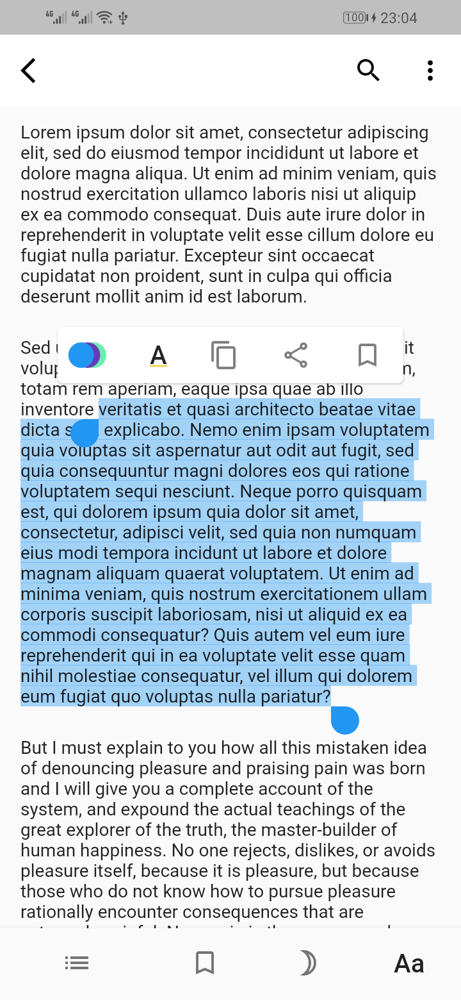
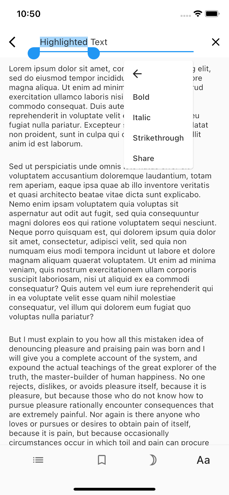

# text_selection_controls

This package allows you to create custom text selection controls and use them in the SelectableText widget or in the TextForm or TextFormField widgets. You can style the texts and the icons to match the theme of your app.

## NOTE: THIS PACKAGE IS DISCONTINUED! 

With the introduction of the contextMenuBuilder property, you can now create custom context menus without the need for a third-party package. This property allows you to return any widget you want from a function, which means that you have complete control over the content and appearance of the context menu.

As a result of this change, there is no longer any need to use the [text_selection_controls] package. If you need to create a custom context menu for a widget, you can simply use the contextMenuBuilder property

## Screenshots

<p>
  
  
</p>

## Installation

In your flutter project add the dependency:

```yaml
dependencies:
    ...
    text_selection_controls: ^[latest_version]
```

Import package:

```dart
import 'package:text_selection_controls/text_selection_controls.dart';
```

## Usage By Example

### On SelectableText Widget

```dart
SelectableText(
 ...,
 selectionControls: FlutterSelectionControls(
  toolBarItems: <ToolBarItem>[]
 ),
...
)
```

### On TextField Widget

```dart
TextFormField(
  selectionControls: FlutterSelectionControls(
    toolBarItems: <ToolBarItem>[]
  ),
...
)
```

## The Tool Bar Item Class

This class takes two arguments: A widget which will be shown on the text selection tool bar and a callback function which will be called when the widget on the text selection tool bar is tapped or pressed.

```dart
class ToolBarItem {
  ToolBarItem({required this.item, this.onItemPressed, this.itemControl})
      : assert(
            onItemPressed == null ? itemControl != null : itemControl == null);
...
}
```

The tool bar item class also gives an option to choose between the handled callbacks actions namely: Select all, copy, cut and paste controls using the `itemControl: ...` argument, or to create your own callback methods using the `onItemPressed: ...` argument. Please not that you can only use one argument only when responding to callbacks.

### An application example of itemControl being used

```dart
import 'package:text_selection_controls/text_selection_controls.dart';
import 'package:flutter/material.dart';


class FlutterControls extends StatelessWidget {
  const FlutterControls({ Key? key }) : super(key: key);

  @override
  Widget build(BuildContext context) {
    return SelectableText(
      'This is an example of selectable text with Select All, Copy, Cut and Paste controls',
      selectionControls: FlutterSelectionControls(toolBarItems: [
        ToolBarItem(item: Text('Select All'), itemControl: ToolBarItemControl.selectAll),
        ToolBarItem(item: Icon(Icons.copy), itemControl: ToolBarItemControl.copy),
        ToolBarItem(item: Icon(Icons.cut), itemControl: ToolBarItemControl.cut),
        ToolBarItem(item: Icon(Icons.paste), itemControl: ToolBarItemControl.paste),

      ]),
    );
  }
}
```

### An application example of onItemPressed being used

```dart
import 'package:text_selection_controls/text_selection_controls.dart';
import 'package:flutter/material.dart';


class CustomControls extends StatelessWidget {
  const CustomControls({Key? key}) : super(key: key);

  @override
  Widget build(BuildContext context) {
    return SelectableText(
      'This is an example of selectable text with a custom control.',
      selectionControls: FlutterSelectionControls(toolBarItems: [
        ToolBarItem(
            item: Icon(Icons.bookmark),
            onItemPressed: (String highlightedText, int startIndex, int endIndex) {
              print('Highlighted Text: $highlightedText');
              //TODO 
            })
      ]),
    );
  }
}

```

## Windows, Linux and MacOS platforms + Web

The `text_selection_controls:` package is designed for android and iOS applications but also note that it is still safe to use with these platforms even though the text selection tool bar does not show when a text is highlighted.
